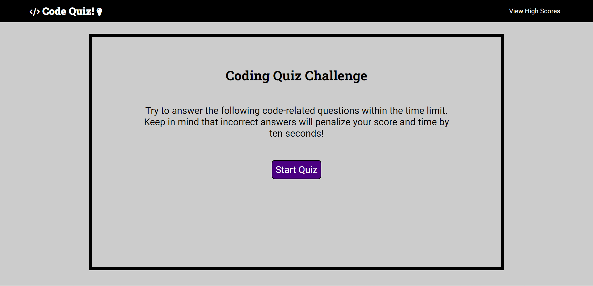
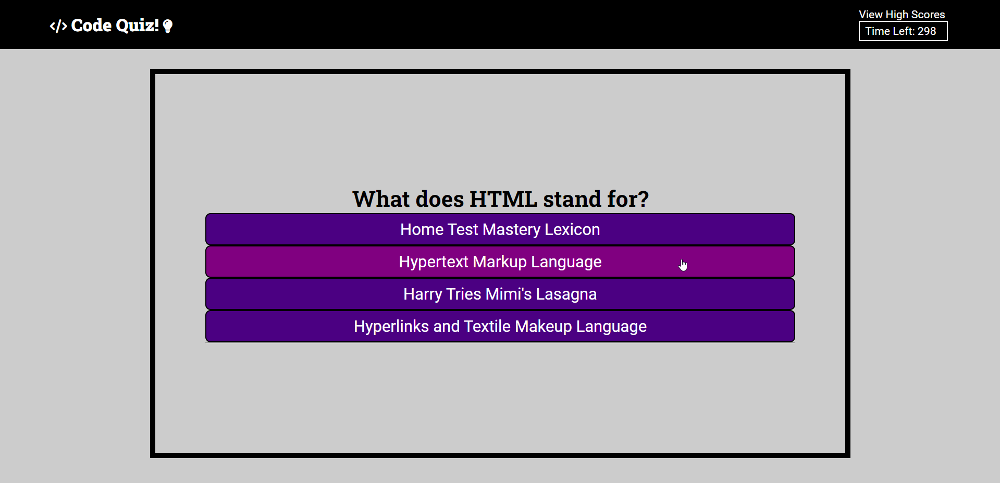
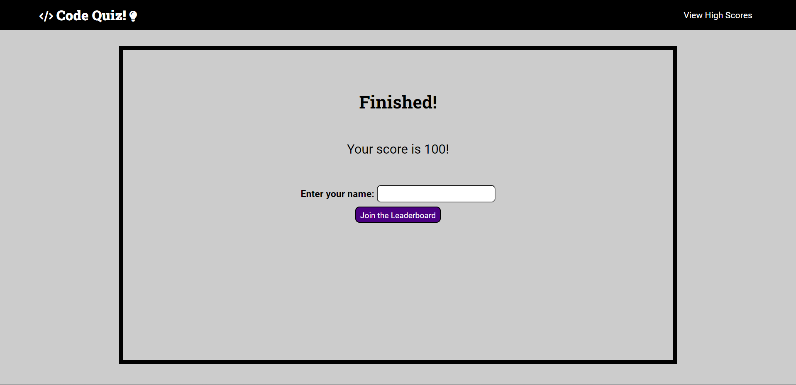

# Code Quiz!

## Site Description

Code Quiz is a timed quiz app consisting of 10 multiple choice questions related to HTML, CSS, and Javascript.
As each question is answered, the user will be presented with an answer confirmation as to whether they
got the previous question right or wrong. If their answer is incorrect, 10 secons will be deducted from the
remaining time. When the last question is answered, the user is presented with their final score and they 
are given the option to insert their initials to join the high scores leaderboard.

## Screenshots

## Deployed Site

